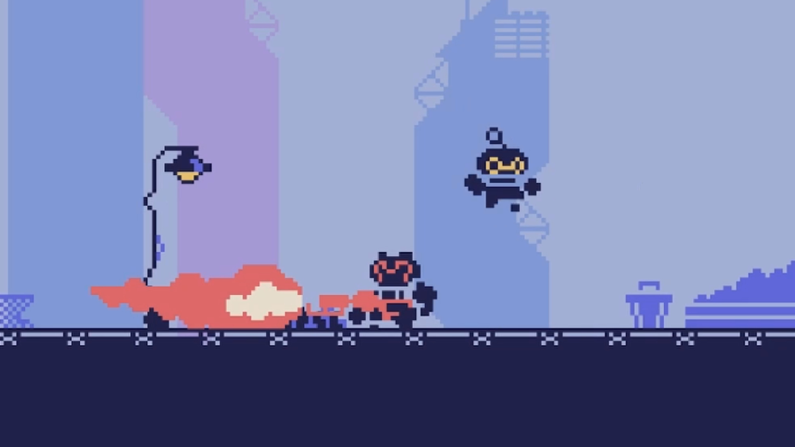
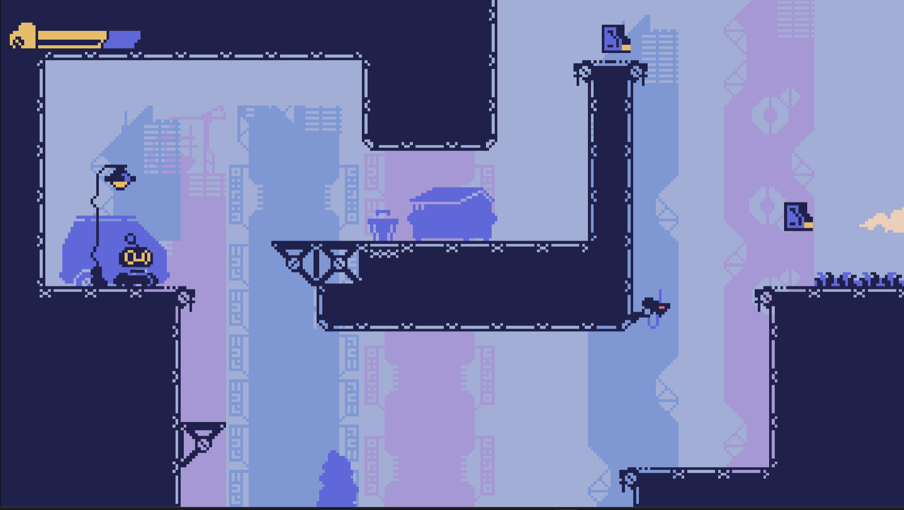
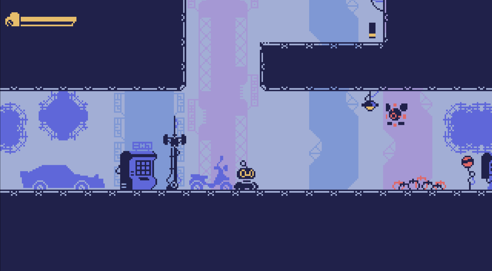

# Factory Escape Game

Welcome to the **Factory Escape Game**! This thrilling adventure challenges you to navigate through various rooms, avoid enemies, and ultimately escape the factory. Use your skills to overcome obstacles and defeat enemy bosses.



## 🚀 Installation

To get started with the Factory Escape Game, follow these steps. The preferred method is to use a modern browser-based development environment or a local development server for an optimal experience:

1. **Clone the repository:**
    ```sh
    git clone https://github.com/rk-vashista/Metroidvania-Game
    ```

2. **Navigate to the project directory:**
    ```sh
    cd Metroidvania-Game
    ```

3. **Open the game:**
   Launch the project using your preferred method (e.g., a local server or browser-based development environment).

## 🕹️ Usage

Open your browser and navigate to [http://localhost:3000](http://localhost:3000).



### 📂 Directory Structure

- **assets/**: Contains game assets such as fonts, palettes, sounds, and sprites (e.g., `background.png`, `theme.mp3`).
- **lib/**: Includes the Kaboom.js library and its version information (e.g., `kaboom.min.js`).
- **maps/**: Stores JSON files for the game rooms (e.g., `level1.json`, `bossRoom.json`).
- **src/**: Contains the source code for the game:
    - **entities/**: Scripts for game entities like enemies (e.g., `enemy.js`) and the player (e.g., `player.js`).
    - **scenes/**: Scripts for different game scenes (e.g., `gameStart.js`, `gameOver.js`) and utilities.
    - **state/**: Global state manager scripts (e.g., `gameState.js`).
    - **ui/**: Scripts for UI components like health bars (e.g., `healthBar.js`) and notification boxes (e.g., `notifications.js`).

- **assets/**: Contains game assets such as fonts, palettes, sounds, and sprites.
- **lib/**: Includes the Kaboom.js library and its version information.
- **maps/**: Stores JSON files for the game rooms.
- **src/**: Contains the source code for the game:
    - **entities/**: Scripts for game entities like enemies and the player.
    - **scenes/**: Scripts for different game scenes and utilities.
    - **state/**: Global state manager scripts.
    - **ui/**: Scripts for UI components like health bars and notification boxes.

## 🎮 Gameplay

In the Factory Escape Game, your goal is to navigate through a series of interconnected rooms, collect essential items, and avoid or defeat enemies to escape the factory. For example, you might start by solving a puzzle to unlock a door, find a weapon to fight off a boss enemy, and finally, escape through the exit before time runs out.

### Controls

- **Arrow keys**: Move
- **Up arrow**: Jump
- **Z**: Attack
- **Enter**: Start the game



## 🤝 Contributing

We welcome contributions! To contribute, please follow these steps:

1. **Fork the repository.**

2. **Create a new branch:**
    ```sh
    git checkout -b feature/your-feature-name
    ```

3. **Make your changes and commit them:**
    ```sh
    git commit -m "Add your message"
    ```

4. **Push to the branch:**
    ```sh
    git push origin feature/your-feature-name
    ```

5. **Open a pull request.**

For more details, see our [contribution guidelines](CONTRIBUTING.md).

We welcome contributions! To contribute, please follow these steps:

1. **Fork the repository.**

2. **Create a new branch:**
    ```sh
    git checkout -b feature/your-feature-name
    ```

3. **Make your changes and commit them:**
    ```sh
    git commit -m "Add your message"
    ```

4. **Push to the branch:**
    ```sh
    git push origin feature/your-feature-name
    ```

5. **Open a pull request.**

## 🎨 Original Assets

Original assets for the game can be found at [https://venoxxx.itch.io/pixxxelpunkkk-toolkit](https://venoxxx.itch.io/pixxxelpunkkk-toolkit).

## 📜 License

This project is licensed under the MIT License. See the [LICENSE](LICENSE) file for more information.

Enjoy your adventure in the Factory Escape Game!

