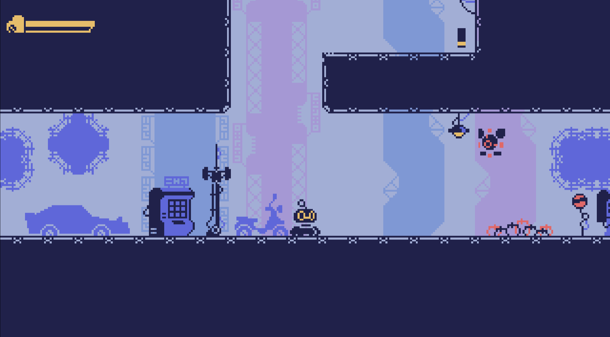

# Factory Escape Game


Welcome to the **Factory Escape Game**! This thrilling adventure challenges you to navigate through various rooms, avoid enemies, and ultimately escape the factory. Use your skills to overcome obstacles and defeat the enemy bosses.


## 🚀 Installation

To get started with the Factory Escape Game, follow these steps:

1. **Clone the repository:**
    ```sh
    git clone https://github.com/rk-vashista/Metroidvania-Game
    ```
    

2. **Navigate to the project directory:**
    ```sh
    cd Metroidvania-Game
    ```


## 🕹️ Usage

Open your browser and navigate to [http://localhost:3000](http://localhost:3000).


### 📂 Directory Descriptions

- **assets/**: Contains game assets like fonts, palettes, sounds, and sprites.
- **lib/**: Contains the Kaboom.js library and its version information.
- **maps/**: Contains JSON files for the game rooms.
- **src/**: Contains the source code for the game.
    - **entities/**: Scripts for game entities like enemies and the player.
    - **scenes/**: Scripts for different game scenes and utilities.
    - **state/**: Global state manager scripts.
    - **ui/**: Scripts for UI components like health bars and notification boxes.


## 🎮 Gameplay

### Controls

- **Arrow keys**: Move
- **Up arrow**: Jump
- **Z**: Attack
- **Enter**: Start the game




## 🤝 Contributing

We welcome contributions! To contribute, please follow these steps:

1. **Fork the repository.**
   
2. **Create a new branch:**
    ```sh
    git checkout -b feature/your-feature-name
    ```

3. **Make your changes and commit them:**
    ```sh
    git commit -m "Add your message"
    ```

4. **Push to the branch:**
    ```sh
    git push origin feature/your-feature-name
    ```

5. **Open a pull request.**
    

### 👾 Original assets can be found at:
[https://venoxxx.itch.io/pixxxelpunkkk-toolkit](https://venoxxx.itch.io/pixxxelpunkkk-toolkit)

## 📜 License

This project is licensed under the MIT License. See the [LICENSE](LICENSE) file for more information.

Enjoy your adventure in the Factory Escape Game!